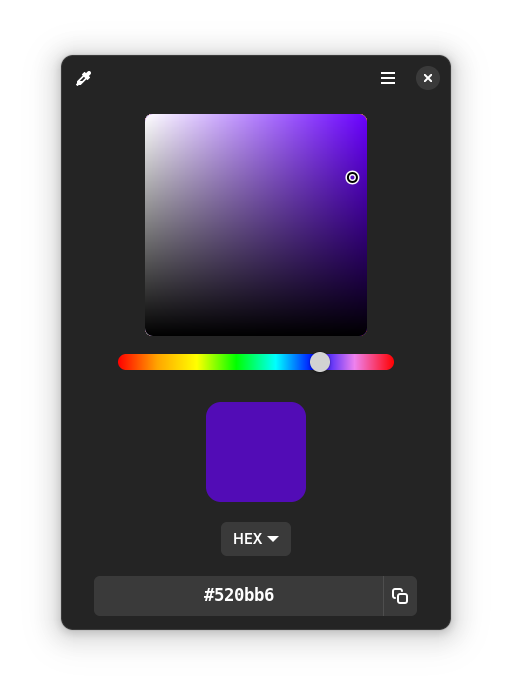

<div align="center">

# Colorful

**Pick a color from your screen, use it wherever you want.**

</div>

An easy to use color picker. Flatpak friendly, crossdesktop.

<div align="center">

</div>

## Install and Running

Colorful will be released in Flathub when it reaches version 1.0.

### GNOME Builder

The recommended way of running this project is through Flatpak and GNOME Builder. Clone the project and run. Requires the `org.gnome.Platform` runtime, from the master branch. You can get it from the GNOME Nightly Flatpak remote. Libportal and Libshumate will be built with the project.

To install, use the *Export as package* feature (available in the top bar omniarea) and open the `.flatpak` double-clicking, and install.

### Other

This project requires the following dependencies:

```
gtk4
libadwaita-1
libportal-gtk4
```

Build using the Meson Build System:

```sh
meson builddir --prefix=/usr
cd builddir
ninja
./src/colorfulgtk
```

To install, run in the `builddir`:

```sh
sudo ninja install
```

## Credits

The Chooser widget was borrowed from [Colorway](https://github.com/lainsce/colorway/). Thanks to Lainsce for creating such an amazing app!
